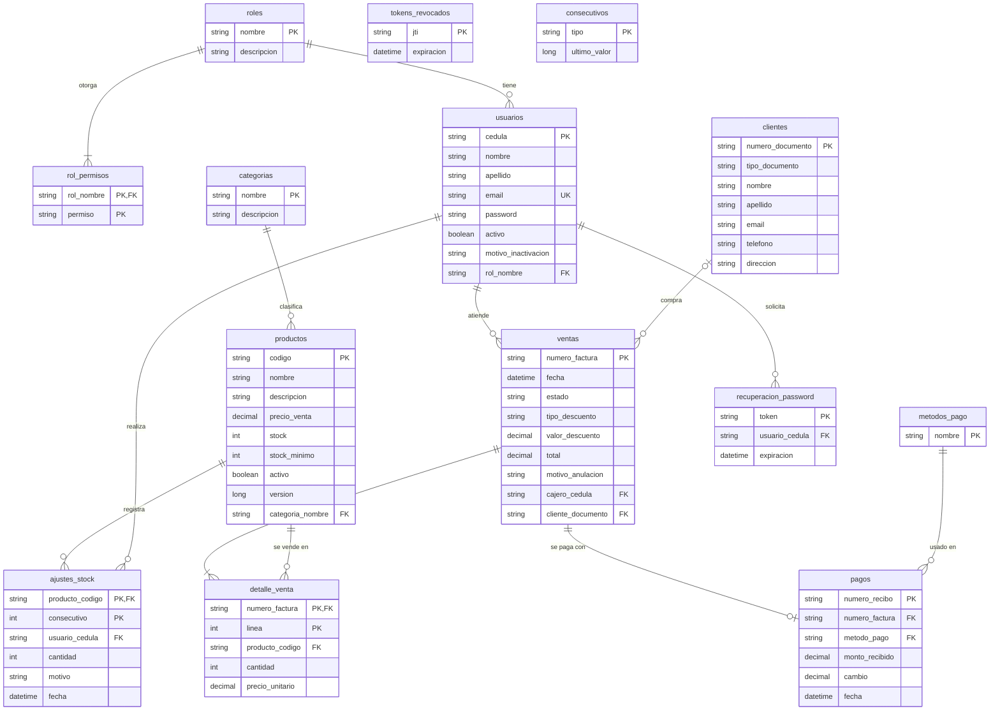

# Modelo de datos

Diagrama entidad-relación del sistema POS. Es el diseño de referencia: las migraciones SQL y las entidades JPA se derivan de él. Todas las llaves primarias son datos propios de la entidad (ninguna autogenerada), como pidió el profesor.

Estado: borrador para revisión. Sprint 1 implementado; Sprint 2 a Sprint 5 son proyección.

## Llaves y decisiones

| Tabla | Llave primaria | Sprint |
|---|---|---|
| `usuarios` | `cedula` | 1 |
| `roles` | `nombre` (mayúsculas) | 1 |
| `rol_permisos` | (`rol_nombre`, `permiso`) | 1 |
| `categorias` | `nombre` | 1 |
| `tokens_revocados` | `jti` | 1 |
| `productos` | `codigo` | 2 |
| `ajustes_stock` | (`producto_codigo`, `consecutivo`) | 2 |
| `clientes` | `numero_documento` | 2 |
| `metodos_pago` | `nombre` | 3 |
| `consecutivos` | `tipo` | 3 |
| `ventas` | `numero_factura` | 3 |
| `detalle_venta` | (`numero_factura`, `linea`) | 3 |
| `pagos` | `numero_recibo` | 4 |
| `recuperacion_password` | `token` | 5 |

- **`clientes`**: `numero_documento` es la llave; `tipo_documento` es una columna normal.
- **Números de factura y de recibo**: los genera la aplicación (por ejemplo `F-000001`) a partir de la tabla `consecutivos`, leyendo y aumentando el último valor dentro de una transacción con bloqueo, para que dos cajeros simultáneos no obtengan el mismo número. La base no usa autoincremental.
- **`ajustes_stock` y `detalle_venta`**: no tienen un dato propio que los identifique por sí solos, así que usan una llave compuesta con un consecutivo por producto (`consecutivo`) o por factura (`linea`).
- **`productos.stock`** guarda el stock actual; `version` evita que dos ajustes o ventas simultáneas se pisen (`@Version`). `ajustes_stock` es el historial de cada ajuste con su motivo.
- **`ventas` 1 a 0..1 `pagos`**: una venta se paga una sola vez (no hay pagos parciales en los requisitos).
- **Factura y recibo** (RF-032, RF-035) no son tablas: son documentos generados a partir de `ventas` y `pagos`. Los reportes (RF-036 a RF-040) son consultas.

- **Método de pago**: `metodos_pago` es el catálogo de opciones que el cliente puede usar; `pagos.metodo_pago` guarda el que finalmente se eligió. La venta no guarda método de pago, para no tener el mismo dato en dos lugares. El texto del RF-025 menciona el método de pago como dato de la venta; se ajusta cuando se implemente el Sprint 3.
- **`ventas.estado`** toma tres valores: `EN_PROCESO`, `REGISTRADA` y `ANULADA`.

## Pendiente

- Los requisitos RF-001, RF-004 y RF-006 todavía dicen "nombre de usuario"; el sistema usa la cédula. Se actualizan durante el Sprint 2 junto con los demás documentos.
